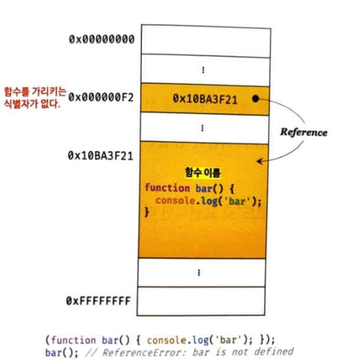
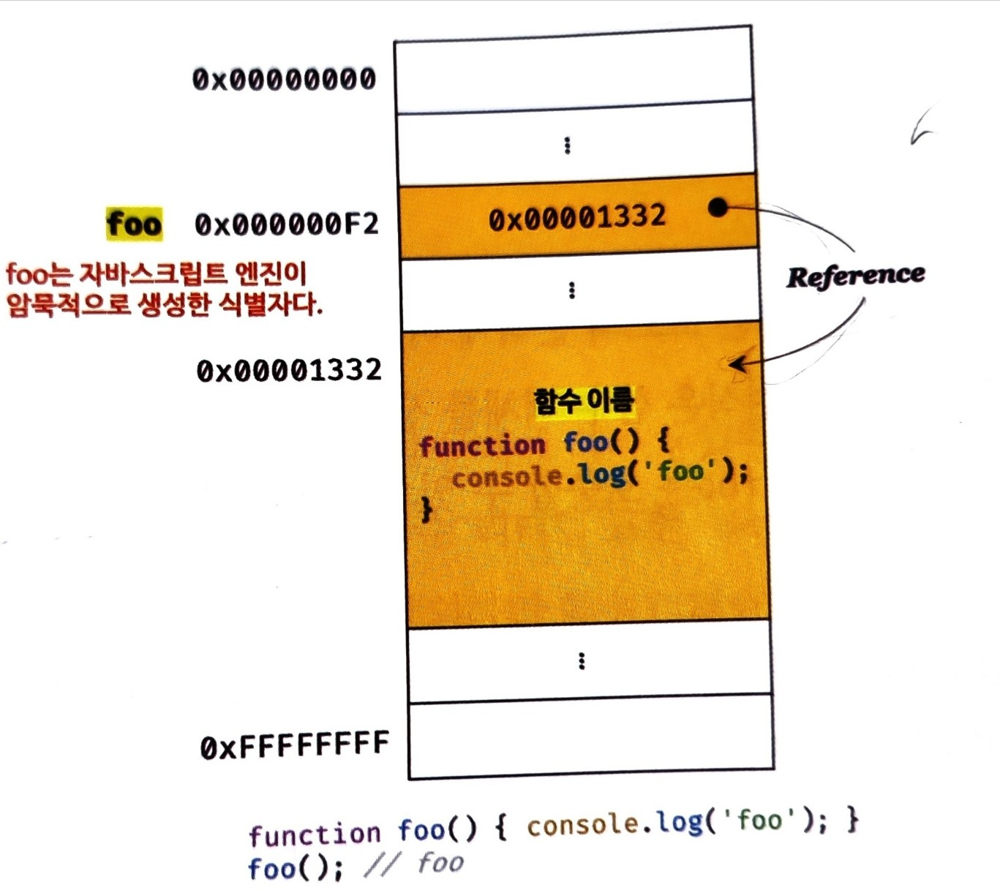

# 함수
## 함수를 사용하는 이유

- 코드의 재사용
	- 동일한 작업을 반복적으로 수행해야 한다면 정의된 함수를 재사용하는 것이 효율적 
- 유지보수 편의성& 코드의 신뢰성 높임
	- 코드의 중복을 억제하고 재사용성 높이면 유지보수의 편의성 및 코드의 신뢰성을 높인다.
- 코드의 가독성 향상

## 함수 리터럴
자바스크립트의 함수는 객체 타입의 값이다. 따라서 숫자나, 객체 처럼 **함수도 함수 리터럴로 생성이 가능하다.**  함수는 객체이고, 일반 객체 와는 다르게 **함수는 호출도 가능하다**

``` js
var f = function add(x,y) {

}
// 여기서 add는 함수 이름, 
// (x,y)는 매개변수 목록 
// {}는 함수 몸체
```

## 함수 정의

`함수 정의`란 함수를 호출하기 이전에 인수를 전달받을 **매개변수**와 **실행할 문들**, 그리고 **반환할 값**을 지정하는 것을 말한다.

함수를 정의하는 방법에는 4가지가 있다.

- 함수 선언문
	```js
	function add(x,y) {
		return x+y;
	}
	```
- 함수 표현식
	```js
	var add = function (x,y) {
		return x + y;
	}
	```
- Function 생성자 함수
	```js
	var add = new Function('x','y',' return x + y');
	```
-  화살표 함수(ES6)
	```js
	var add = (x,y) => x+y;
	```


## 함수 선언문 vs 함수 리터럴 표현식
함수 선언문은 표현식이 아닌 문이고, 함수 리터럴은 표현식이다. 다만, 함수 리터럴은 함수 이름을 생략할 수 있다.

둘의 형태가 동일하므로 자바스크립트 엔진은 코드의 문맥에 따라 둘을 구분한다.
예를 들어, **함수 리터럴을 함수 이름이 있게, 단독으로 사용한다면** `함수 선언문`으로 해석하고, **함수 리터럴이 값으로 평가되어야 하는 문맥, 변수에 할당하거나 피연산자로 사용하면** `함수 리터럴 표현식`으로 해석한다.
```js
function foo () {
	console.log("foo"); // foo
}
foo();

(function bar() { console.log('bar') });
bar(); // Refernce Error bar is defined
```
함수리터럴 foo는 단독으로 사용되었으므로, `함수 선언문`으로 해석되지만, 그룹 연산자()내에 있는 함수 리터럴(bar)는 `함수  리터럴 표현식`으로 해석된다.

**하지만, 함수 선언문 foo는 호출할 수 있지만, 함수 리터럴 표현식 bar는 호출할 수 없다.**

왜?

함수 이름은  **함수 몸체 내에서만 참조할 수 있는 식별자다.**

함수 몸체 외부에서는 함수 이름으로  함수를 참조할 수 없으므로, 함수를 호출할 수 없다. = 즉, 함수를 가리키는 **식별자가 없다** 


함수 리터럴 표현식으로 함수를 호출할 시, 메모리 구조는 다음과 같다.

하지만, 함수 선언문으로 함수를 호출할 시 메모리 구조는 다음과 같다.

여기서 foo는 자바스크립트 엔진이 **암묵적으로 생성한 식별자이다.**

자바스크립트 엔진은 함수 선언문을 해석해 함수 객체로 생성한다. **생성된 함수를 호출하기 위해, 함수 이름과 동일한 이름의 식별자를 암묵적으로 생성하고, 거기에 함수 객체를 할당한다.**

이를 의사코드로 표현하면, 
```js
// 여기서 var add의 add식별자로 함수가 호출되는 것!
var add = function add (x,y) {
	return x+y;
}
console.log(add(2,3)); 


// 함수 이름은 함수 몸체 내부에서만 유효함
// 함수 이름으로 호출한다면, Reference Error
console.log(foo(2,5)) //Reference Error: foo is defined
```
위의 의사코드는 사실, `함수 표현식`이라고 하고, `함수 선언문`는 "표현식이 아닌 문"이고,  `함수 표현식`은 "표현식인 문"이다.

## 함수 생성 시점과 함수 호이스팅

```js
// 함수 참조
console.dir(add) // f add(x,y)
console.dir(sub) // undefined

// 함수 호출
console.log(add(2,3)); // 7
console.log(sub(2,3)); // Type Error

// 함수 선언문
function add(x,y) {
	return x+y;
}

// 함수 표현식
var sub = function (x,y) {
	return x-y;
};
```
**함수 선언문으로 정의한 함수와 함수 표현식으로 정의한 함수의 생성시점은 다르다.**

- 함수 선언문에서는 런타임 이전에 **이미 함수 객체를 생성하고 식별자에 할당한다.**

- 함수 선언문이 코드의 선두로 끌어올려진 것 처럼 동작하는 것을 `함수 호이스팅`이라고 한다.
- `함수 호이스팅`과 다르게 `변수 호이스팅`은 `undefined`로 초기화되고, `함수 호이스팅`의 식별자는 `함수 객체`로 초기화 된다.
-  함수 표현식은 **변수에 할당되는 값이 함수인 것**이므로, `변수 호이스팅`이 발생한다.

## 함수 호출
### 매개변수와 인수
- 함수는 매개변수를 통해 인수를 전달한다.
- 매개변수는 `함수 몸체 내부`에서만 참조할 수 있고 `외부`에서는 참조할 수 없다.
	```js
	function add(x, y) {
	  console.log(x, y); // 1 2
	  return x + y;
	}
	// 함수 내부에서만 참조가능
	add(1, 2);
	console.log(x, y); // ReferenceError: x is not defined
	```
- 자바스크립트에서는 함수에서 인수와 매개변수 일치하는지 체크하지 않는다. 만일 부족하면 나머지 매개변수에는 `암묵적으로 undefined`를 할당한다.
	```js
	// 매개변수의 개수 > 인수의 개수 = 나머지 매개변수 undefined
	function add(x, y) {
	  return a+b // 1 undefined
	}
	console.log(add(2));//NaN
	```
- 사실 초과된  함수는 암묵적으로 arguments객체의 프로퍼티에 보관된다.
	```js
	// 매개변수의 개수 < 인수의 개수 = arguments 에 보관
	function add(x, y) {
	  console.log(arguments); // [Arguments] { '0': 2, '1': 5, '2': 10}
	  return x + y;
	}
	sub(2, 5, 10); // 1
	```
### 인수 확인
> 1. 자바스크립트 함수는 매개변수와 인수의 개수가 일치하는지 확인하지 않는다.
> 2. 자바스크립트는 "동적 타입 언어"다. 따라서 자바스크립트 함수는 매개변수의 "타입을 사전에 지정할 수 없다."

따라서 자바스크립트의 경우 함수를 정의할 때 **적절한 인수가 전달되었는지 확인**이 필요하다.
확인하는 방법은 다음과 같은 것이 있다.
 -   `typeof 연산자`  를 사용하는 방법
		```js
		function add(x, y) {
		  if (typeof x !== "number" || typeof y !== "number") {
		    throw new TypeError("인수는 모두 숫자값 이어야 합니다.");
		  }

		  return x + y;
		}
		console.log(add(1, 2)); // 3
		console.log(add(2)); // TypeError: 인수는 모두 숫자값 이어야 합니다.
		console.log(add("a", "b")); // TypeError: 인수는 모두 숫자값 이어야 합니다.
		```
- 인수가 전달되지 않은 경우  `단축 평가`  를 사용하는 방법	
	```js
	function add(a, b, c) {
	  a = a || 1;
	  b = b || 1;
	  c = c || 1;

	  return a + b + c;
	}
	console.log(add(1, 2, 3)); // 6
	console.log(add(1, 2)); // 4
	console.log(add(1)); // 3
	console.log(add()); // 3
	```
-  `매개변수에 기본값(default value)`  을 사용하는 방법
	```js
	function add(a = 0, b = 0) {
	  return a - b;
	}
	console.log(add(10, 9)); // 19
	console.log(add(10)); // 10
	console.log(add()); // 0
	```
- 정적 타입 언어인 `Typescript` 사용
## 참조에 의한 전달과 외부상태 변경
매개변수의 `타입`에 따라 `값에 의한 전달`, `참조에 의한 전달`이 나뉜다.
```js
// 매개변수 primitive는 원시 값 전달받고, 매개변수 obj는 객체 전달받음
function changeVal(primitive, obj) {
  primitive += 100;
  obj.name = "Kim";
}

// 외부 상태
var num = 100; // 원시 값
var person = { name: "Lee" }; // 객체

console.log(num); // 100
console.log(person); // { name: 'Lee' }

// 원시 값은 값 자체가 복사되어 전달되고 객체는 참조 값이 복사되어 전달된다.
changeVal(num, person);
// 원시 값은 원본 훼손 x
console.log(num); // 100
// 객체는 원본 훼손
console.log(person); // { name: "Lee" }
```
- 원시 값 primitive는 재할당을 통해 **할당된 원시 값을 새로운 원시 값으로 교체했다.**

-  원시 값을 할당한 매개변수를 변경해도 원본 훼손x (부수효과 x)

- 객체 타입 인수를 전달받은 매개변수 obj의 경우 객체는 변경 가능한 값이므로 **직접 할당된 객체를 변경했다.**

- 참조 값을 전달한 객체를 변경할 경우 원본이 훼손(부수효과 발생)

이처럼 함수가 **외부 상태를 변경하면 상태 변화 추적이 어려워진다.**

이러한 문제의 해결방법중 하나는 객체를 `불변 객체`로 만들어 사용하는 것이다.

`깊은 복사`(원본 객체의 완전한 복제)로 완전히 새로운 객체를 생성하고, 재할당을 통해 교체하면, 부수효과를 없앨 수 있다.

## 다양한 함수의 형태
**즉시 실행 함수**

 > 함수 정의와 동시에 즉시 호출되는 함수를 즉시 실행함수라고 한다. 즉시 실행 함수는 단 한번만 호출되며 다시 호출할 수 없다.
	
그룹 연산자(...)로 감싸야하며, 익명함수를 사용하는 것이 일반적이다.

```js
// 즉시 실행 함수도 일반 함수처럼 값을 반환할 수 있다.
var res = (function () {
	var a = 3;
	var b = 2;
	return a+b
})();
console.log(res);
```
**중첩 함수**

	- 함수 내부에 정의된 함수(중첩 함수를 포함하는 함수는 외부 함수라고 부른다.)
	- 외부함수의 함수 내부에서만 호출이 가능하다.
	- 자신을 포함하는 외부 함수를 돕는 `외부 함수` 의 역할을 한다.

```js
function outer() {
	var x = 1;

	// 중첩 함수 == 내부 함수
	function inner() {
	  var y = 2;

	  // 외부 함수의 변수 참조
	  console.log(x + y); // 3
	}

	inner(); 
}

outer();
```
###  콜백 함수
**함수의 매개변수를 통해 다른 함수의 내부로 전달되는 함수**를 `콜백 함수` 라고한다.
- 매개변수를 통해 함수 외부에서 콜백 함수를 전달받은 함수를 `고차 함수`라고 한다.
- 고차 함수는 필요에 따라 콜백 함수에 인수를 전달할 수 있다.  따라서 `콜백 함수를 호출하지 않고 함수 자체를 전달해야 한다.`
```js
// 외부에서 전달받은 func 를 n 만큼 반복 호출
function repeat(n, f) {
  for (var i = 0; i < n; i++) {
    f(i); // i 를 전달하면서 f를 호출
  }
}
// 콜백 함수 정의 - logAll
var logAll = function (i) {
  console.log(i);
};
// 반복 호출할 함수를 인수로 전달
repeat(5, logAll); // 0 1 2 3 4
```
콜백 함수는 함수형 프로그래밍 패러다임뿐만 아니라 비동기 처리(Ajax, 이벤트 처리, 타이머 함수 등)에도 활용되는 중요한 패턴이다.
```js
// 콜백 함수를 이용한 이벤트 처리
document.getElementById('myButton').addEventListener('click', 
function() {
	console.log('button clicked');
});

// 콜백 함수를 사용한 비동기 처리
setTimeout(function () {
	console.log('1초 경과');
},1000);
```
**순수 함수와 비순수 함수**

어떤 외부상태에도 의존하지도 않고, 변경하지도 않는 즉 **부수효과가 없는 함수**를 `순수 함수` 라고 하고, 외부 상태에 의존하거나 외부 상태를 변경하는 즉 **부수효과가 있는 함수**를 `비순수 함수`라고 한다.