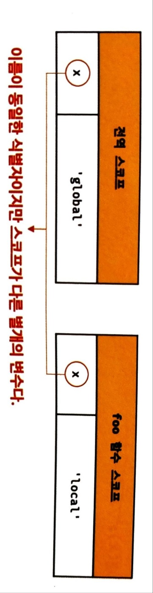
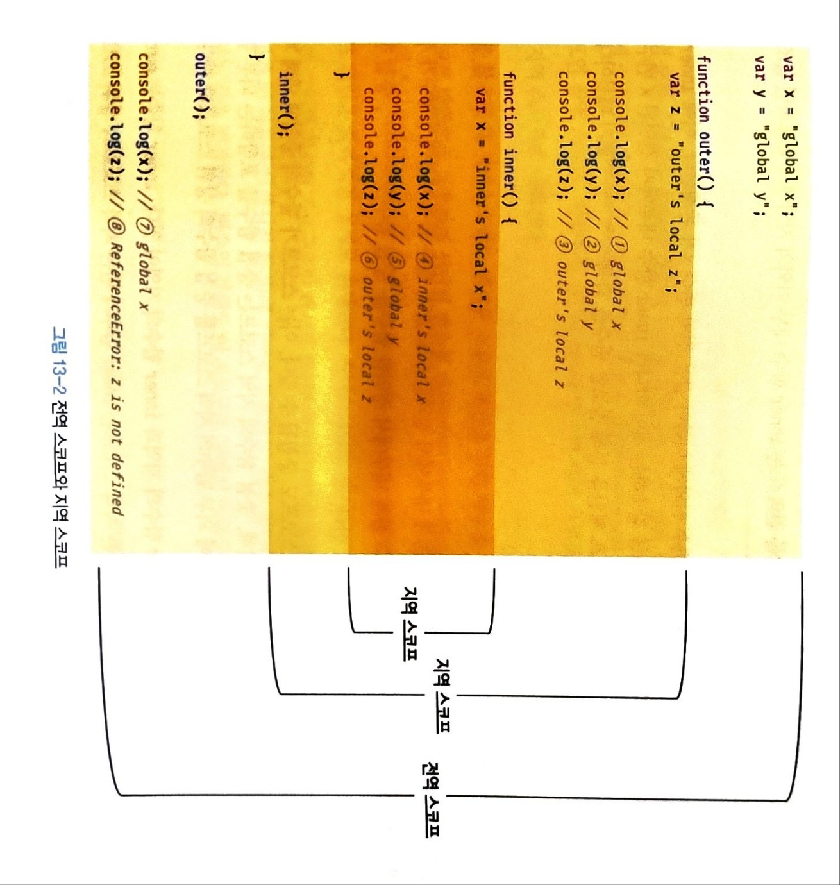
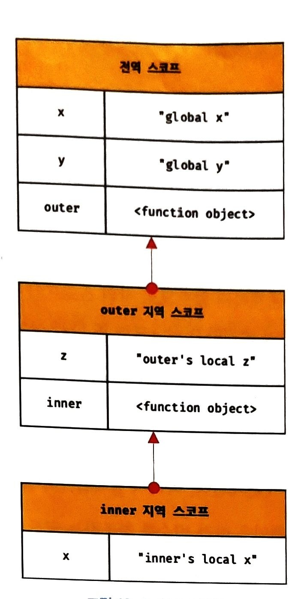

# 스코프

## 스코프란?

> 모든 식별자는 자신이 선언된 위치에 의해 다른 코드가 식별자 자신을 참조할 수 있는 유효범위가 결정된다. 이를 **스코프**라고 한다.

```js
var var1 = 1; // 코드의 가장 바깥 영역에서 선언한 변수

if (true) {
  var var2 = 2; // 코드 블록 내에서 선언한 변수
  if (true) {
    var var3 = 3; // 중첩된 코드 블록 내에서 선언한 변수
  }
}

function foo() {
  var var4 = 4; // 함수 내에서 선언한 변수

  function bar() {
    var var5 = 5; // 중첩된 함수 내에서 선언한 변수
  }
}

console.log(var1); // 1
console.log(var2); // 2
console.log(var3); // 3
console.log(var4); // ReferenceError: var4 is not defined
console.log(var5); // ReferenceError: var5 is not defined
```

### 식별자 결정

자바스크립트 엔진은 두 개의 변수 중에 어떤 변수를 참조해야하는지 결정하는데 이를 `식별자 결정` 이라고 한다.

-  자바스크립트 엔진은 코드를 실행할 때 코드의 `문맥`을 고려,
- 코드가 어디서 실행되며, 주변에 어떤 코드가 있는 지에 따라 동일한 코드도 다른 결과를 만들어낸다.

```js
var x = "global";

function foo() {
  var x = "local";
  console.log(x); // 1
}

foo();
console.log(x); //2
```

스코프라는 개념이 없다면, 같은 이름을 가진 변수는 충돌을 일으키므로 프로그램 전체에서 하나밖에 사용할 수 없다.

식별자는 어떤 값을 구별해야 하므로 **유일**해야한다.  즉, 하나의 값은 **유일한 식별자**에 연결되어야 한다.

> ex) 파일 이름 다른 폴더에서 같은 이름의 파일 존재 가능
> 
스코프 내에서 식별자는 유일해야 하지만 다른 스코프에는 같은 이름의 식별자를 사용할 수 있다.

## 스코프의 종류

| 구분 | 설명                  | 스코프      | 변수      |
| ---- | --------------------- | ----------- | --------- |
| 전역 | 코드의 가장 바깥 영역 | 전역 스코프 | 전역 변수 |
| 지역 | 함수 몸체 내부        | 지역 스코프 | 지역 변수 |

- 변수는 `자신이 선언된 위치`에 따라 자신의 유효한 범위인 스코프가 결정된다. 
- 전역에서 선언된 변수는 전역 스코프를 가진 `전역 변수` 이고,  **어디서든지 참조 할 수 있다.**
- 지역에서 선언된 변수는 지역 스코프를 갖는 `지역 변수`이고, **자신의 지역 스코프와 하위 지역 스코프에서 참조 가능하다.**

## 스코프 체인
스코프가 함수의 중첩에 의해 계층적 구조를 갖는 것, 스코프가 계층적으로 연결된 것을 **스코프 체인** 이라고 한다.

위의 그림에서 
- 지역은 outer함수의 지역, inner함수의 지역이 있다. 
- inner 함수는 outer함수의 `중첩 함수`이다. 
-  `outer함수가 만든 지역 스코프`는 `inner함수가 만든 지역 스코프`의 **상위 스코프**이다.
- 그리고 outer 함수의 지역 스코프의 상위 스코프는 전역 스코프이다.
<p align="center">
</p>

**변수를 참조할 때 자바스크립트 엔진은 스코프 체인을 통해 변수를 참조하는 코드의 스코프에서 시작하여 상위 스코프 방향으로 이동하여 선언된 변수를 검색한다.**

**상위 스코프에서 유효한 변수는 하위 스코프에서 자유롭게 참조할 수 있지만, 하위 스코프에서 유효한 변수는 상위에서 참조 불가능**

### 스코프 체인에 의한 함수 검색

```js
// 전역 함수
function foo() {
	console.log('global function foo');
}

function bar() {
	// 중첩 함수
	function foo() {
		console.log('local function foo');
	}
	foo(); // 1
}
bar();
```
- 함수를 정의하면 런타임 이전에 함수 객체가 먼저 생성된다.
- 자바스크립트 엔진은 함수 이름과 동일한 이름의 식별자를 `암묵적으로 선언하고 생성된 함수 객체를 할당한다.`

1 에서 foo 함수 호출 하면 엔진은 함수를 호출하기 위해 먼저 함수를 가리키는 식별자 foo를 검색

함수도 식별자에 할당되기 위해 스코프를 갖는다. 
따라서 스코프는 `식별자를 검색하는 규칙` 이라고 표현하는 것이 적합하다.

## 함수 레벨 스코프
-   `블록 레벨 스코프(block level scope)`
    -   함수 몸체만이 아니라 모든 코드 블록(if, for, while, try - catch 등)이 지역 스코프를 만든다.
   -   `함수 레벨 스코프(function level scope)`
    -   자바스크립트에서  `var 키워드로 선언된 변수`  는  `오로지 함수의 코드블록(함수 몸체)만`을 지역 스코프로 인정한다.
```js
var x = 1;

if (true) {
	// var 키워드로 선언된 변수는 함수의 코드블록 만을 지역스코프로 인정
  // 따라서 var코드로 선언된 변수는 코드 블록 내에 선언되었다 할지라도 모두 전역변수
  // 따라서 x는 전역변수 이고, 그로 인해, 변수 x는 전역에 있는 것과 if문 내부에 있는 것으로 중복 선언 된 것이라 볼 수 있다.
 // 의도치 않게 변수 값이 변경되는 부작용
  var x = 10;
}

console.log(x); // 10
```

## 렉시컬 스코프
자바스크립트는 **렉시컬스코프**를 따른다. 

- 동적 스코프
	- 함수가 어디서 **호출**되었는지에 따라 결정
- 정적 스코프 또는 렉시컬스코프
	- 함수를 어디서 **정의** 했는지에 따라 상위스코프를 결정

```js
var x = 1;

function foo () {
	var x = 10;
	bar();
}
function bar() {
	console.log(x);
}
foo(); // 1
bar(); // 1
```

bar 함수는  전역에서 정의된 함수이다. 
- bar 함수 객체는 전역코드가 실행되기 전 먼저 평가되어 함수객체 생성
- 이때 bar 함수 객체는 자신이 정의된 전역 스코프를 기억
- bar함수가 호출되면 자신이 호출된 곳이 어디든 자신이 기억하고 있는 전역 스코프를 상위스코프로 사용한다.

그러므로 전역변수 x의 값 1을 두번 출력