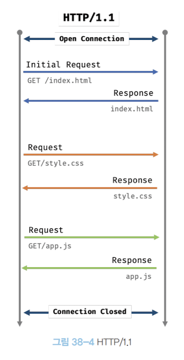

# 브라우저 렌더링 과정
브라우저가 HTML, CSS, JS로 작성된 텍스트 문서를 어떻게 파싱하여 브라우저에 렌더링하는지 살펴보자.

- **파싱** :  `파싱`(구문 분석)은 프로그래밍 언어의 문법에 맞게 작성된 텍스트 문서를 읽어 들여 실행하기 위해 텍스트 문서의 `문자열`을 `토큰으로 분해`하고, 토큰에 문법적 의미와 구조를 반영하여 `트리 구조인 자료구조인 파스 트리를 생성`하는 일련의 과정을 말한다. 
- **렌더링**: 렌더링은 HTML, CSS, 자바스크립트로 작성된 문서를 `파싱`하여 브라우저에 `시각적으로 출력`하는 것을 말한다.

**브라우저의 렌더링 과정은 다음과 같다.**
- 브라우저는 HTML, CSS, 자바스크립트, 이미지, 폰트 파일 등 렌더링에 필요한 리소스를 요청하고 서버로부터 응답을 받는다.
- 브라우저 렌더링 엔진은 서버로부터 응답된 HTML과 CSS를 파싱하여 DOM과 CSSOM을 생성하고 이들을 결합하여 렌더 트리를 생성한다.
- 브라우저의 자바스크립트 엔진은 서버로부터 응답된 자바스크립트를 파싱하여 AST를 생성하고 바이트코드로 변환하여 실행한다. 이때 자바스크립트는 DOM API를 통해 DOM이나 CSSOM을 변경할 수 있다. 변경된 DOM과 CSSOM은 다시 렌더 트리로 결합된다.
- 렌더 트리를 기반으로 HTML 요소의 레이아웃을 계산하고 브라우저 화면에 HTML 요소를 페인팅한다.

## 요청과 응답
브라우저의 핵심 기능은 필요한 리소스(HTML, CSS, 자바스크립트, 이미지, 폰트 등의 정적 파일 또는 서버가 동적으로 생성한 데이터)를 서버에 `요청`하고 서버로부터 `응답`을 받아 브라우저에 시각적으로 렌더링하는 것이다.

서버에 요청을 전송하기 위해 브라우저는 주소창을 제공한다. 브라우저의 주소창에 `URL`을 입력하고 엔터 키를 누르면 URL의 `호스트이름`이 `DNS`를 통해 `IP주소`로 변환되고 이 IP주소를 갖는 서버에게 요청을 전송한다.

> - 예를 들어, 브라우저의 주소창에 https://poiemaweb.com을 입력하고 엔터 키를 누르면 루트 요청(https(Scheme)://poiemaweb.com(호스트)만으로 구성된 URI에 의한 요청)이 poienmaweb.com 서버로 전송된다. 일반 적으로 서버는 루트요청에 대해 암묵적으로 index.html을 응답하도록 기본 설정되어 있다. 
- 따라서, 서버는 루트 폴더에 존재하는 index.html을 클라이언트로 응답한다. 만일, 다른 정적파일을 서버에 요청하고 싶다면 https://poiemaweb.com/assets/data/data.json와 같이 요청할 정적 파일의 경로와 파일 이름을 URI의 호스트 뒤의 패스에 기술하여 서버에 요청한다.

요청과 응답에 관해서는 개발자 도구의 Network 패널에서 볼 수 있는데 브라우저 엔진은 index.html 뿐만 아니라 CSS, 자바스크립트, 이미지, 폰트 파일 등도 응답한다.

이는 브라우저의 렌더링 엔진이 HTML을 파싱하는 도중에 외부 리소스를 로드하는 태그, 즉 css파일을 로드하는 link태그, 이미지 파일을 로드하는 img 태그, 자바스크립트를 로드하는 script 태그 등을 만나면 **HTML파싱을 일시 중단하고 해당 리소스 파일을 서버로 요청**하기 때문이다. 

## HTTP 1.1과 HTTP 2.0

`HTTP`는 웹에서 브라우저와 서버가 통신하기 위한 프로토콜(규약)이다. 

- `HTTP/1.1`은 기본적으로 커넥션당 하나의 요청과 하나의 응답만 처리한다. 즉, 여러 개의 요청을 한 번에 전송할 수 없고 응답 또한 마찬가지다. 따라서 HTML 문서 내에 포함된 리소스 요청과 응답이 개별적으로 전송된다. `HTTP/1.1`은 리소스의 동시 전송이 불가능한 구조이므로 요청할 리소스의 개수에 비례하여 응답시간이 증가하는 단점도 있다.

- `HTTP/2`는 커넥션당 여러개의 요청과 응답, 즉 다중 요청/응답이 가능하다. 
`HTTP/2.0`은 여러 리소스의 동시 전송이 가능하므로 `HTTP/1.1`에 비해 페이지 로드 속도가 약 50%정도 빠르다고 알려져 있다.

## HTML 파싱과 DOM 생성
- 브라우저의 요청에 의해 서버가 응답한 HTML문서는 문자열로 이뤄진 순수한 텍스트다.
 
- 순수한 텍스트인 HTML문서를 브라우저에 시각적인 픽셀로 렌더링하려면 HTML 문서를 브라우저가 이해할 수 있는 자료구조(객체)로 변환하여 메모리에 저장해야 한다. 

- 브라우저의 렌더링 엔진은 다음 그림과 같은 과정을 통해 응답받은 HTML문서를 파싱하여 브라우저가 이해할 수 있는 자료구조인 **DOM**을 생성한다.

-   서버에 존재하던  HTML  파일이 브라우저의 `요청에 의해 응답`된다.
	   - 이때 서버는 브라우저가 요청한  HTML  파일을 읽어 들여 메모리에 저장한 다음 메모리에 저장된  `바이트(2진수)`를 인터넷을 경유하여 응답한다.
-   브라우저는 서버가 응답한  `HTML` 문서를 `바이트 형태`로 응답받는다.
    
    -   그리고 응답된 바이트 형태의  HTML  문서는  `meta`  태그의  `charset`  어트리뷰트에 의해 지정된 인코딩 방식을 기준으로  `문자열`로 변환된다.
-   문자열로 변환된  HTML  문서를 읽어 들여 문법적 의미를 갖는 코드의 최소 단위인  `토큰들`로 분해한다.  
    
-   각 토큰들을 객체로 변환하여  `노드`들을 생성한다. 노드는 이후  `DOM`을 구성하는 기본 요소가 된다.
-   HTML  문서는  `HTML  요소들의 집합`으로 이루어지며 **HTML  요소는 중첩 관계를 갖는다.**
    
    -   이러한  `HTML`  요소 간의 부자 관계를 반영하여 **모든 노드들을 트리 자료구조로 구성**한다.
    -   이 **노드들로 구성된 트리 구조를  `DOM`이라 부른다.**

즉,  `DOM`은  **HTML 문서를 파싱한 결과물**이다.

## CSS 파싱과 CSSOM생성
- 렌더링 엔진은 `HTML`을 처음부터 한 줄 씩 순차적으로 파싱하여 `DOM`을 생성해 나간다.

- 이처럼 렌더링 엔진은 DOM을 생성해나가다가 CSS를 로드하는 `link 태그`나 `style 태그`를 만나면 **DOM 생성을 일시 중단한다.**

- link태그의 href 어트리뷰트에 지정된 CSS파일을 서버에 요청하여 로드한 CSS파일이나 style 태그 내의 CSS를 HTML과 동일한 파싱 과정을 거치며 해석하여 `CSSOM`을 생성한다.
- 이후 `CSS` 파싱을 완료하면 `HTML` 파싱이 중단된 지점부터 다시 `HTML`을 파싱하기 시작하여 `DOM` 생성을 재개한다.

## 렌더 트리 생성
렌더링 엔진은 서버로부터 응답된 `HTML`과 `CSS`를 파싱하여 각각 `DOM`과 `CSSOM`을 생성하고 이들은 렌더링을 위해 `렌더 트리`로 결합된다.

`렌더 트리`는 **렌더링을 위한** `트리 구조`의 자료구조다. 
따라서 브라우저 화면에 렌더링되지 않는 노드와 CSS에 의해 비표시되는 노드들은 포함하지 않는다. 
렌더 트리는 **브라우저 화면에 렌더링되는 노드만으로 구성**된다. 

이후 완성된 렌더 트리는 각 `HTML` 요소의 레이아웃을 계산하는 데 사용되며 브라우저 화면에 픽셀을 렌더링하는 페인팅 처리에 입력된다.

지금까지 살펴본 브라우저 렌더링 과정은 반복해서 실행될 수 있다. 
예를 들어, 다음과 같은 경우 반복해서 레이아웃 계산과 페인팅이 재차 실행된다.
- 자바스크립트에 의한 노드 추가와 삭제
- 브라우저 창의 리사이징에 의한 뷰포트 크기 변경
- HTML 레이아웃 변경
(
레이아웃 계산과 페인팅을 다시 실행하는 리렌더링은 비용이 많이 드는, 성능에 악영향을 주는 작업이다. 따라서 가급적 리렌더링이 빈번하게 발생하지 않도록 주의해야 한다.